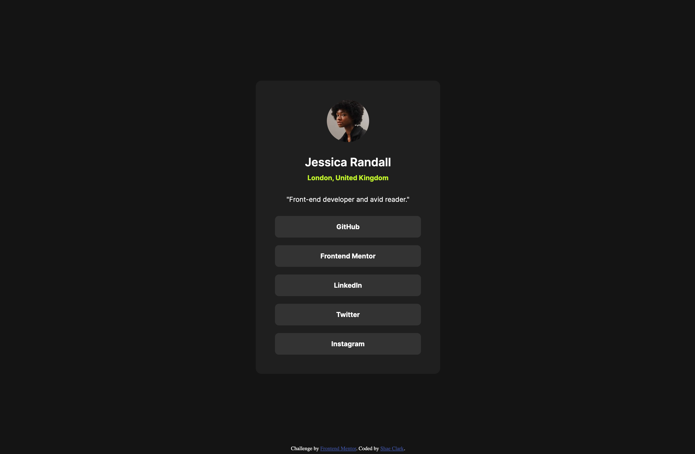

# Frontend Mentor - Social Links Profile solution

Tried more to get the pixel alignment right with this one. Went a little off the course getting it aligned for 320px screens.

This is a solution to the [Blog preview card challenge on Frontend Mentor](https://www.frontendmentor.io/challenges/blog-preview-card-ckPaj01IcS). Frontend Mentor challenges help you improve your coding skills by building realistic projects. 

## Table of contents

- [Overview](#overview)
  - [The challenge](#the-challenge)
  - [Screenshot](#screenshot)
- [My process](#my-process)
  - [Built with](#built-with)
  - [What I learned](#what-i-learned)
  - [Continued development](#continued-development)
- [Author](#author)
- [Acknowledgments](#acknowledgments)

## Overview

### The challenge

Users should be able to:

- See hover and focus states for all interactive elements on the page

### Screenshot

## My process

Again I used Figma, and it's still immensely easier to reference that than to eyeball everything.

### Built with

- Semantic HTML5 markup
- CSS custom properties
- Flexbox
- Responsive design (three stages, accomodates min-width: 320px)

### What I learned

Fun with roots and variable naming in CSS. Lots of review otherwise. Hardest part was actually maintaining font accurace.

Never used @font-face in CSS before to import a font.

### Continued development

For future projects I would like to make the responsive design feel more second-nature or seamless to the end user. Additionally, could clean up namespace.

## Author

- Frontend Mentor - [@MalakDynamics](https://www.frontendmentor.io/profile/MalakDynamics)

## Acknowledgments

Thanks to Frontend Mentor for all the assets and practice projects!
